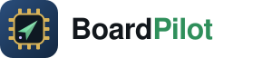
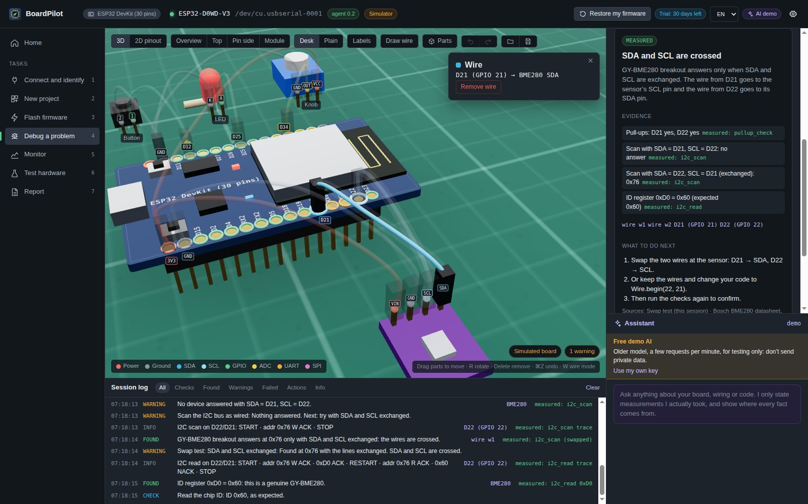
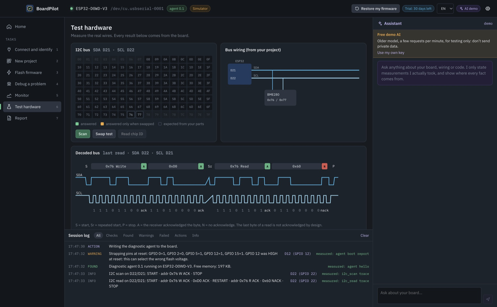
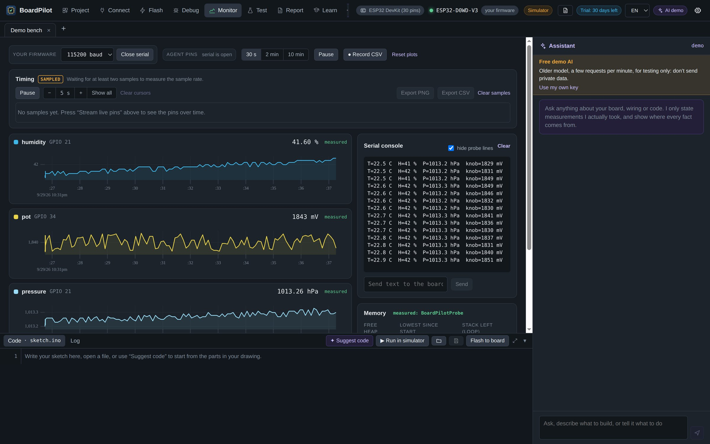
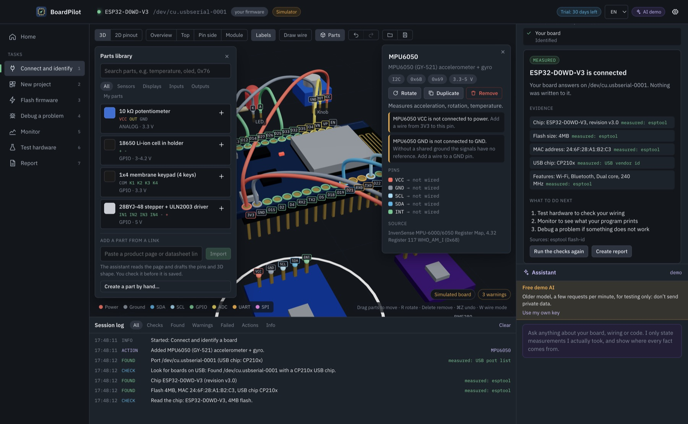
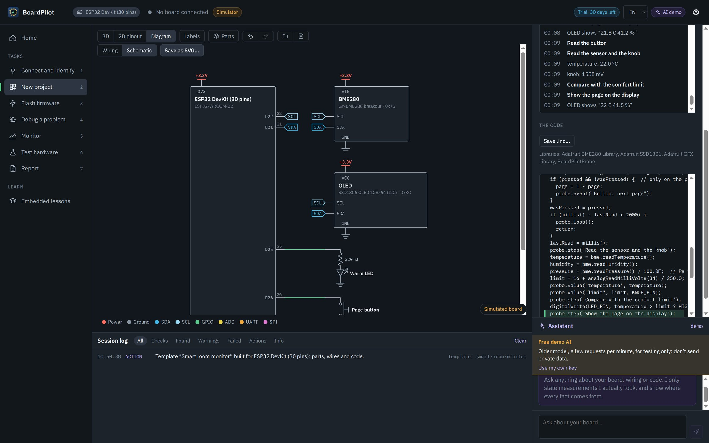
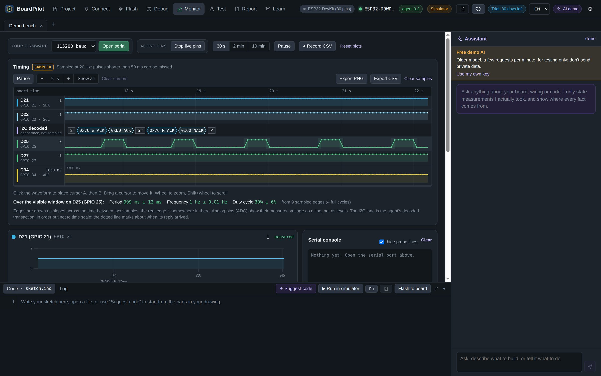
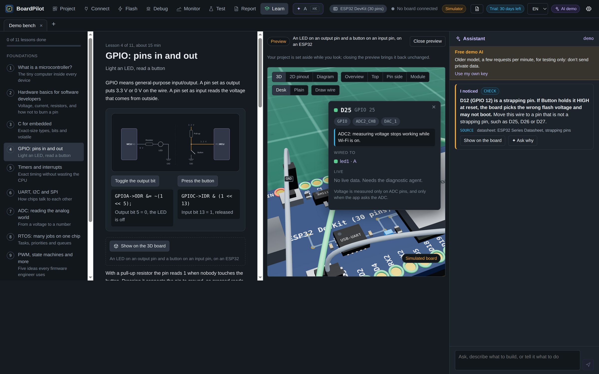
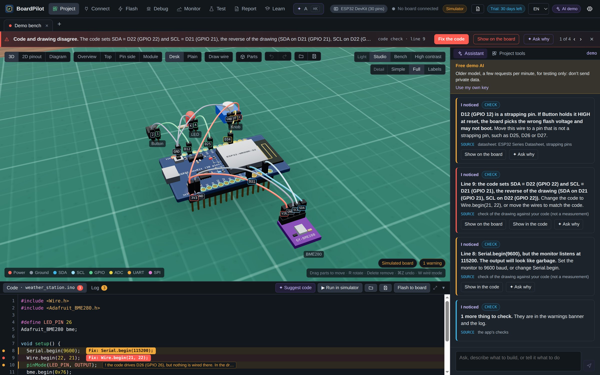
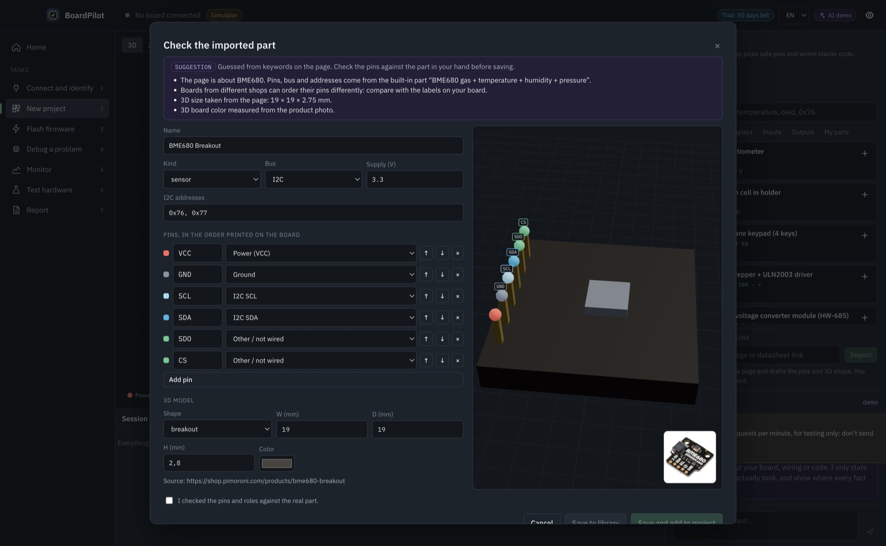

<p align="center">
  <picture>
    <source media="(prefers-color-scheme: dark)" srcset="docs/logo-dark.svg">
    
  </picture>
</p>

<p align="center"><b>See inside your board.</b> A desktop app that finds wiring mistakes, decodes I2C and shows every pin, wire and bus transaction on a live 3D board: ESP32, Raspberry Pi Pico, Arduino, STM32, nRF52 and Teensy. It also plans your project (pins, schematic, shopping list, starter firmware), teaches embedded with hands-on labs checked on the board, and lets AI coding agents use the real board through MCP.<br>English and Italian · macOS and Windows · works without hardware in simulator mode.</p>

<p align="center">
  <a href="https://github.com/mojeee/boardpilot/releases/latest"></a>
  <a href="https://github.com/mojeee/boardpilot/actions/workflows/ci.yml"></a>
  <a href="https://boardpilot.agentflowbind.com/parts/"></a>
  <a href="parts/LICENSE"></a>
  
  
  <a href="docs/mcp.md"></a>
</p>

<p align="center">
  <a href="https://boardpilot.agentflowbind.com"><b>Website</b></a> ·
  <a href="https://github.com/mojeee/boardpilot/releases/latest/download/BoardPilot-mac-arm64.dmg">Mac (Apple Silicon)</a> ·
  <a href="https://github.com/mojeee/boardpilot/releases/latest/download/BoardPilot-mac-x64.dmg">Mac (Intel)</a> ·
  <a href="https://github.com/mojeee/boardpilot/releases/latest/download/BoardPilot-win-x64.exe">Windows</a> ·
  <a href="https://boardpilot.agentflowbind.com/parts/"><b>Parts library</b></a> ·
  <a href="https://boardpilot.agentflowbind.com/boards/">Board pinouts</a> ·
  <a href="docs/README.md">Docs</a>
</p>



<p align="center"><sub>If BoardPilot helped you find a wiring mistake, a ⭐ helps other makers find it too.</sub></p>

## Why BoardPilot

Most "my sensor does not work" problems are wiring: SDA and SCL swapped, a missing ground, a 5 V module on a 3.3 V pin, an LED on an input-only GPIO, a strapping pin that stops the board from booting. BoardPilot **measures** the real pins through a small diagnostic firmware, **shows** the result on a 3D model of your board, and **explains** the cause in plain words, with the evidence and the datasheet section behind every claim.

- **Look before asking.** It detects the board, chip, flash and USB bridge by itself, and asks only for what it cannot see.
- **Safe by default.** Read-only unless you confirm; your firmware is backed up before the first write and comes back with one click.
- **Honest AI.** The optional assistant only states what it measured, labels guesses as suggestions and cites sources.

## Supported boards

| Family | Boards | Flashing |
|---|---|---|
| ESP32 | ESP32 DevKit (30 pins), ESP32-S3-DevKitC-1, ESP32-C3-DevKitM-1 | esptool |
| Raspberry Pi | Pico, Pico W (RP2040), Pico 2 (RP2350) | picotool / UF2 |
| Arduino (AVR) | Uno R3, Nano, Mega 2560 | avrdude |
| STM32 | NUCLEO-F401RE, Black Pill F411CE | STM32CubeProgrammer, stlink or dfu-util |
| Nordic | nRF52840 DK | nrfjprog |
| Teensy | Teensy 4.1 | Teensy Loader |

Boards are data files in [`boards/`](boards/) (pins with positions, flags and sources, default buses, toolchain, USB ids); validate them with `node scripts/check-boards.mjs`. Pinout pages: <https://boardpilot.agentflowbind.com/boards/>.

## Features

| | |
|---|---|
|  **Debug wizard** Pull-ups, I2C scan, SDA/SCL swap test, chip ID (tells a BMP280 from a BME280), brownout and baud-rate detection. |  **Test hardware** I2C address grid, bus diagram, bit-level decoded transactions, GPIO and ADC tests. |
|  **Monitor** Serial console, live plots colored by pin, CSV recording, heap and stack. |  **Parts library** Add, move, rotate and wire parts in 3D; wiring rules flag mistakes as you build. |

Also: connect and identify (esptool v4/v5), safe flashing with automatic backup, new-project pin assignment with a starter sketch, reports as Markdown and PDF, English and Italian UI, 30-day free trial.

### New in 0.6.0

Everything below is in the [0.6.0 release](https://github.com/mojeee/boardpilot/releases/latest); details in [CHANGELOG.md](CHANGELOG.md).

| | |
|---|---|
|  **Wiring diagram and schematic** A flat wiring view and a real schematic from your 3D drawing, with net labels, power symbols and the pull-ups the rules suggest drawn dashed. Both export as SVG and go into the report. |  **Timing view** Logic-analyser rows for every streamed pin with the decoded I2C transaction under SDA/SCL, cursors, and period, frequency and duty with their uncertainty. Labelled "sampled", with the real sample rate. |
|  **Embedded lessons** 11 visual lessons from zero to senior, with interactive demos, "Show on the 3D board" previews, hands-on labs checked on your board, and an interview coach. |  **Code vs wiring checker** Compares your Arduino sketch with the drawing: swapped `Wire.begin` pins, outputs on input-only pins, the LED on another pin, the wrong baud rate. |

**Build a project**
- **8 template projects** that build themselves on any of the 13 boards (parts, wires from the board's own pin rules, and code), run in the simulator with a live story of what the program does.
- **Pin planner**: say what you need (I2C, SPI, UARTs, analog inputs, PWM) and get pins with the reason for each.
- **Shopping list** with the extras the wiring rules imply (pull-ups, dividers, level shifters), as CSV or Markdown.
- **Power budget and battery life** from datasheet currents; parts without a figure are listed as unknown, never guessed.
- **Clock-aware calculators** for timers/PWM, UART baud and ADC rate, with register values and ready-to-paste code for each toolchain.
- **State machine designer**: draw states and events, get a diagram, C code, a unit test for every transition and an Arduino sketch.
- **Starter firmware** as an Arduino sketch or a **Pico SDK** project (built every night with the real SDK).
- **Portfolio projects**: a Smart room monitor, an Industrial sensor node and a Predictive-maintenance device, each built in checked stages, with hints first and a README for GitHub at the end.

**Debug and measure**
- **Register maps, decoded live** for the BME280, MPU6050 and SSD1306 (read-only, every register with its datasheet section).
- **Flash pre-flight check**: the file is checked against the board (chip, flash size, UF2 family, HEX checksums, STM32 vector table) before anything is written.
- **Part gotchas**: 44 known traps for the 27 most used parts, with sources, shown the moment you add the part.
- A new wiring rule for two I2C parts at the same address.

**Learn**
- **Hands-on labs** (blink, button, knob, I2C sensor) checked with live data through the diagnostic agent; a passed lab marks its lesson done.
- **Interview coach**: practise the answer to every lesson's interview questions; feedback cites the lesson section, and your answers stay on your computer.

**For AI coding agents**
- **BoardPilot as an MCP server**: Claude Code, Cursor or Claude Desktop can scan the I2C bus, read pins and check wiring and code on your real board. Every result says whether it was measured or documented, and writes only happen after your click in the app. Setup: [docs/mcp.md](docs/mcp.md).

## The open parts library

**380+ sensors, displays, drivers, radios and modules**, each with its pins and roles, supply voltage, I2C addresses, chip-ID register, 3D shape and sources. The data is **free to reuse under [CC BY 4.0](parts/LICENSE)**:

- Browse it: <https://boardpilot.agentflowbind.com/parts/> (one page per part with the ESP32 wiring and starter code)
- Download it: <https://boardpilot.agentflowbind.com/parts.json>
- Source files: [`parts/`](parts/)
- Missing a part? [Request it](https://github.com/mojeee/boardpilot/issues/new?template=new-part.yml) or open a pull request (see [docs/parts-library.md](docs/parts-library.md)).

In the app you can also paste a product link: BoardPilot recognises the chip, reads the board size, measures the board color from the product photo and drafts the part with a 3D model, for you to check before saving.



## AI assistant

Optional. It works out of the box with a **free demo** (an older Gemini model through BoardPilot's rate-limited test relay; for testing only, don't send private data), or with **your own key** for Claude, GPT or Gemini, stored encrypted on your computer. See [docs/ai.md](docs/ai.md).

## Install

Download from the [latest release](https://github.com/mojeee/boardpilot/releases/latest). Early builds are not code-signed yet: on Mac right-click the app → Open; on Windows click *More info → Run anyway*. For real boards install esptool (see [docs/hardware-setup.md](docs/hardware-setup.md)); simulator mode needs nothing.

## Contribute in 30 minutes

No big code changes needed to help:

- **Add a board**: one JSON file and its sources. Guide: [Add your board in 30 minutes](docs/add-a-board.md). Or [request a board](https://github.com/mojeee/boardpilot/issues/new?template=new-board.yml).
- **Add a part** to the open library: see [docs/parts-library.md](docs/parts-library.md), or [request a part](https://github.com/mojeee/boardpilot/issues/new?template=new-part.yml).
- **Add a template project**: one JSON file, see [docs/templates.md](docs/templates.md).
- **Translate**: every UI string is in `shared/i18n/it/*.ts`; a new language is a new folder next to it.
- Look for issues labelled [good first issue](https://github.com/mojeee/boardpilot/labels/good%20first%20issue).

## Develop

```bash
npm install
npm run dev          # the app, in simulator mode
npm test             # 2800+ tests (Vitest); npm run typecheck
npm run build:agent  # rebuild the ESP32 diagnostic agent (arduino-cli + esp32 core)
npm run dist:mac     # .dmg files in dist/
npm run dist:win     # Windows installer in dist/
npm run build:web    # the browser demo ("Try it live") in site/demo/, simulator only
npm run build:site   # build:web, then regenerate the website and the parts pages
node scripts/screenshots.mjs  # retake the README and website screenshots (after npm run build)
node scripts/gen-starters.mjs out && PICO_SDK_PATH=~/pico-sdk bash scripts/build-starters.sh out  # compile the starters
```

Architecture, product rules and conventions: [CLAUDE.md](CLAUDE.md). Contributing: [CONTRIBUTING.md](CONTRIBUTING.md). Changes: [CHANGELOG.md](CHANGELOG.md).

## License

| What | License |
|---|---|
| The app (this repository, except below) | [BoardPilot License](LICENSE.md): source-available, free 30-day trial, then a license key |
| `parts/` (parts library data) | [CC BY 4.0](parts/LICENSE) |
| `firmware/` (diagnostic agent, BoardPilotProbe library) | [MIT](firmware/LICENSE) |

Made in Italy by [Mojtaba Amini](https://github.com/mojeee).
