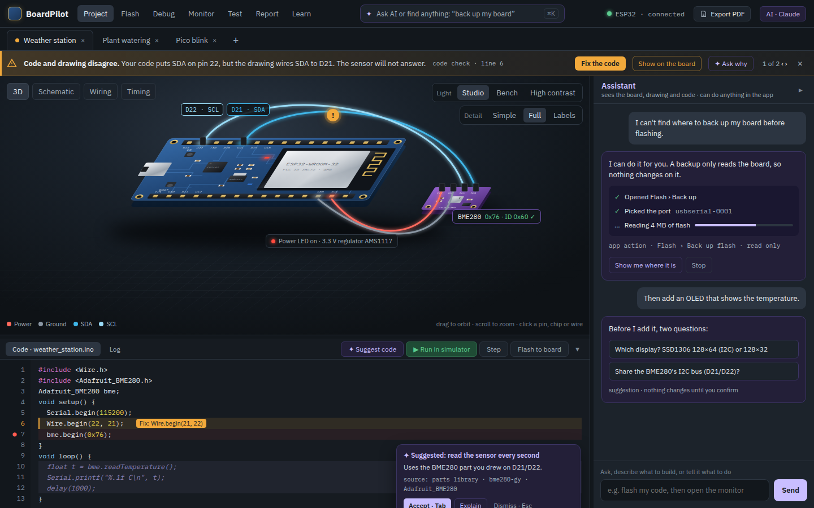
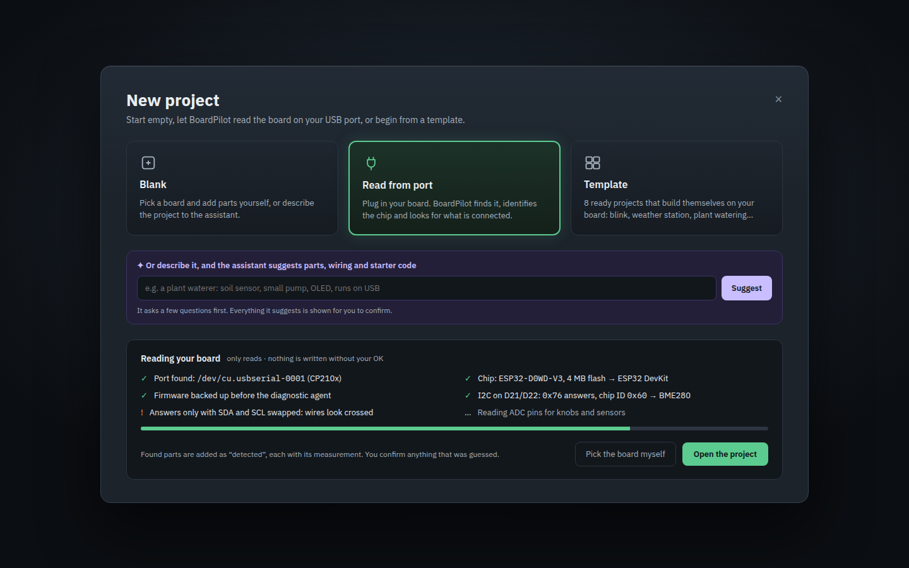
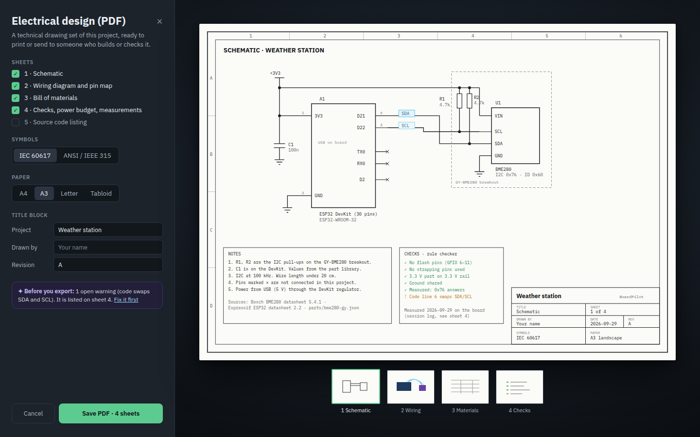

# Workspace redesign mockups (Sep 29, not built yet)

Target screens for the plan in `docs/roadmap-2026-10.md`, section "Next · Workspace redesign".

| Screen | Preview | Source |
|---|---|---|
| Project workspace: top menu, project tabs, warning banner, lit and detailed 3D board, Code/Log panel with AI code suggestions, assistant that does app actions |  | `Main.dc.html` |
| New project: Blank, Read from port, Template, or describe it to the assistant |  | `NewProject.dc.html` |
| Export: electrical design as a PDF drawing set |  | `Export.dc.html` |

The `.dc.html` files open in any browser (plain HTML and inline SVG, colours from the design tokens in
`CLAUDE.md`). They are also on the design canvas: https://claude.ai/artifact/7ZXocFamKF2neLh5cnJgeL

To redo the previews after editing a file (Chromium headless, then crop to 1440×900):

```sh
chromium --headless=new --hide-scrollbars --window-size=1440,1000 --screenshot=Main.png Main.dc.html
```
